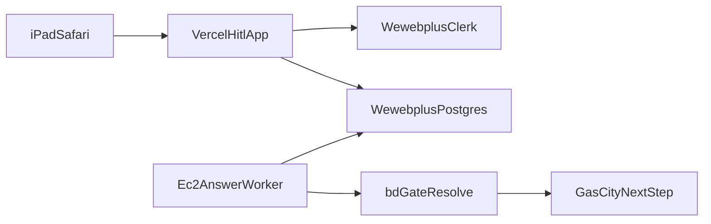

# Vercel HITL page for iPad

Handoff for the Cursor cloud agent that starts in `Awannaphasch2016/dyad` and is linked to this pull request: https://github.com/Awannaphasch2016/impeccable-talks/pull/4

## Already on this pull request

Branch `cursor/vercel-hitl-web-0278` in `Awannaphasch2016/impeccable-talks` already contains `hitl-web/`. It is a Next.js app. `npm test` covers the role rules. `npm run build` completes when Clerk keys are present.

The talks agent cannot push to `Awannaphasch2016/dyad`. GitHub returned 403 for `cursor[bot]` on that session. The Cursor GitHub app on the `Awannaphasch2016` account is now set to **All repositories**, with read and write access to code. A new agent started in the Dyad project should be able to push.

Copy `hitl-web/` from this branch into `Awannaphasch2016/dyad` and push it. Do not rebuild the page from scratch. After the folder is on a Dyad branch, the Vercel import is:

- Git repository: `Awannaphasch2016/dyad`
- Branch: the Dyad branch that contains `hitl-web`
- Vercel team: `Anak`
- Project name: `wewebplus-hitl`
- Root directory: `hitl-web`
- Application preset: `Next.js`

Leave the existing ai-pilot Vercel project untouched. Do not add a repo-root multi-service `vercel.json`.

The app reads `WEWEBPLUS_DATABASE_URL`, `NEXT_PUBLIC_CLERK_PUBLISHABLE_KEY`, `CLERK_SECRET_KEY`, `NEXT_PUBLIC_CLERK_SIGN_IN_URL=/sign-in`, and `NEXT_PUBLIC_CLERK_SIGN_UP_URL=/sign-up`. Use the Wewebplus Clerk keys and the Wewebplus Postgres URL from the Dyad Doppler config. The Doppler project `ai-pilot` config `dev` holds a Vercel token, and its Supabase URL is a different database.

## Goal

Ship a phone-sized web page on Vercel. The Project Manager and Developer sign in with the existing Wewebplus Clerk users, see the open gate, and submit the answer. Gas City and `bd` stay on EC2.

## What is already true

- Role rules already exist in the Dyad HITL module: `plan-approve` and `review-approve-pm` target `project-manager`; `review-approve-dev` targets `developer`. A member of the other role sees status only. Someone outside Wewebplus gets nothing.
- Test users already exist: Project Manager `anakwannaphaschaiyong@gmail.com`, Developer `awannaphasch2016@fau.edu`.
- The factory on EC2 inserts the question row when a gate opens. The answer row is what the worker will watch.
- `gascity/experiments/hitl/hitl.py` in this repo still releases the next shell step after `bd gate resolve`.
- `hitl-web/lib/hitl.ts` on this branch already applies those same role rules. The page lists questions and stores one answer in `wewebplus.answers`. It does not run `bd`.

## Token check before deploy

Doppler project `ai-pilot`, config `dev`, has `VERCEL_TOKEN`, `VERCEL_ORG_ID`, and `VERCEL_PROJECT_ID`. A read-only API call with that token returned HTTP 403 for both the stored team and the personal scope `anak-wannaphaschaiyongs-projects`. The stored project id is the existing ai-pilot app. `VERCEL_ORG_ID` in that config is the placeholder `team_`.

The Vercel account now has a team named `Anak` on the Pro plan. Before the first deploy, confirm the token can create a project in that team. If it still returns 403, replace `VERCEL_TOKEN` with a token created in the `Anak` team, scoped to all projects. Create a new Vercel project named `wewebplus-hitl`. Leave the ai-pilot project untouched.

Do not write tokens into the repo.

## Web app

`hitl-web/` is the app. Keep it self-contained so the Vercel root directory can be `hitl-web` without the Electron app.

Pages:

- `/` Clerk sign-in, then the question list.
- One list is enough. No Electron shell, no `window.electron`.

API routes, session required:

- `GET /api/questions` loads open and recent `wewebplus.questions` for the caller’s org. The response includes `body` and `canAnswer` only when the caller’s role matches and the question is open.
- `POST /api/questions/[id]/answers` inserts one `wewebplus.answers` row and marks the question answered. A second submit for the same question is a no-op.

Vercel env:

- `NEXT_PUBLIC_CLERK_PUBLISHABLE_KEY`, `CLERK_SECRET_KEY`
- `WEWEBPLUS_DATABASE_URL` for the Wewebplus schema
- `NEXT_PUBLIC_CLERK_SIGN_IN_URL=/sign-in`
- `NEXT_PUBLIC_CLERK_SIGN_UP_URL=/sign-up`
- Clerk allowed origin and redirect set to the new `*.vercel.app` URL

## EC2 worker

Add a poller on the EC2 host next to the existing factory bridge. Every few seconds it selects answers that have no gate-resolved timestamp, then for each one:

1. `bd --actor "<answered-by name>" gate resolve <bead> --reason "approved by <name>"`
2. `hitl.py release` for that step, using the rig `multi tenant HITL`.
3. Stamp the answer so it is not resolved twice.

Vercel never shells out to `bd`. Postgres is the only link between the page and the rig.

## Deploy and walkthrough

Deploy `hitl-web` to the new Vercel project. Start one fresh approval run so `plan-approve` is the only open gate. Then the iPad check is:

1. Open the Vercel URL in Safari.
2. Sign in as the Project Manager. The plan question body and answer box are visible. Submit the approval.
3. Stay on the page. The plan question becomes answered. The developer-review question appears as waiting, with no body and no answer box.
4. Sign out. Sign in as the Developer. The developer-review body and answer box are visible. The plan question is answered. Submit.
5. Sign back in as the Project Manager. The final review body is visible. Submit.
6. On EC2, confirm three Dolt commits, actors `Anak Wannaphaschaiyong` then the Developer username then `Anak Wannaphaschaiyong`, and the Gas City run finished.

## Out of scope

The full Dyad editor, the Cloudflare tunnel, and remote desktop stay as they are. This plan only adds the HITL page, its API, the answer poller, and the new Vercel project.
